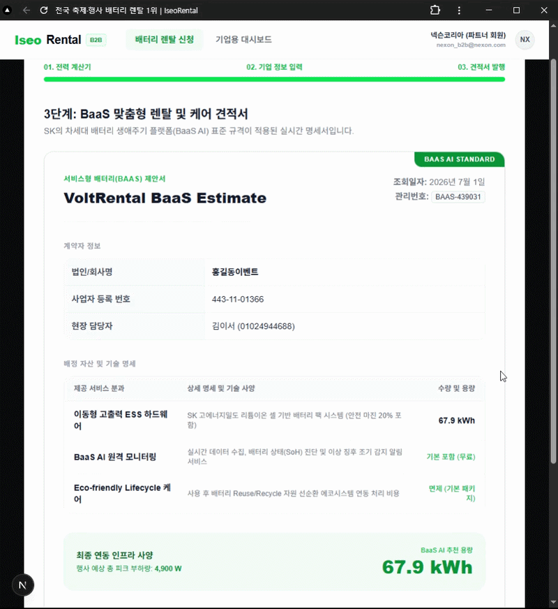

# B2B 이동형 ESS 배터리 렌탈 계산기

> Next.js 15와 Tailwind CSS를 기반으로 개발된 B2B 전용 이동형 배터리(ESS) 소요량 산출 및 실시간 견적 SPA 플랫폼입니다.

## 주요 구현 기능 (Core Features)

### 1. 실시간 부하량 기반 배터리 매칭 계산기 (Step 1)

- **지능형 스펙 산출:** 공연 음향, 무대 조명, 식음료 기기 등 대형 하드웨어 프리셋별 소비 전력 기준 산정
- **안전 마진 자동 설계:** B2B ESS 환경의 피크 부하 및 서지 전압을 대비한 **20%의 안전 마진(Safety Margin)** 자동 연산 알고리즘 탑재

### 2. 웹 접근성을 준수한 시맨틱 기업 정보 폼 (Step 2)

- **UX 방어 로직:** 필수 기업 정보 및 사업자 등록 번호 규격(하이픈 포함 12자리) 미충족 시 다음 단계 진입을 원천 차단하는 유효성 검증
- **컴포넌트 렌더링 최적화:** 부모-자식 컴포넌트 간의 빈번한 데이터 갱신 과정에서 발생할 수 있는 무한 루프 에러(Maximum update depth exceeded)를 원천 차단. 상위 컴포넌트의 콜백 함수를 useCallback으로 메모이제이션하여 불필요한 자원 낭비를 방지하고 웹 브라우저의 실행 성능을 극대화함.

### 3. SK BaaS 표준 규격 반영 실시간 견적서 발행 (Step 3)

- **BaaS 패러다임 투영:** 단순 기기 대여를 넘어 `BaaS AI 원격 모니터링(SoH 진단)` 및 `사용 후 배터리 재사용(Reuse/Recycle)` 프로세스를 명세서에 포함
- **정갈한 데이터 맵핑:** 인쇄 및 캡처에 최적화된 정밀 Grid 레이아웃 설계

## 기술 스택 (Tech Stack)

- **Framework:** Next.js 15 (App Router)
- **Styling:** Tailwind CSS
- **Language:** TypeScript
- **Architecture:** 컴포넌트 기반 아키텍처 (관심사 분리)
  - `RentalFormSPA.tsx` (메인 SPA 상태 관제 및 스텝 제어)
  - ├── `DeviceCalculator.tsx` (1단계: 하드웨어 전력 연산 및 실시간 갱신)
  - ├── `CompanyForm.tsx` (2단계: 기업용 시맨틱 입력 폼)
  - └── `QuoteResult.tsx` (3단계: BaaS 종합 청약 명세서)

## 추가 예정 기능 (Roadmap)

B2B 사용자(현장 총괄 및 구매 담당자)의 실무 편의성과 결재 프로세스 단축을 위해 아래 기능을 고도화할 예정입니다.

### 1. 디지털 명세서 PDF 다운로드 및 즉시 인쇄

- **실무 결재용 문서화:** 발행된 SK BaaS 표준 견적서를 별도의 캡처 없이 정식 가견적서 양식의 PDF 파일로 로컬 다운로드 및 프린터 즉시 출력 기능 지원 (`html2canvas` 및 `jspdf` 라이브러리 연동 예정).

### 2. 전력 데이터 엑셀(CSV) 추출 및 이메일 공유

- **인프라 실측 데이터 백업:** 1단계에서 산출된 기기별 부하량 및 예상 시간 명세 데이터를 내부 보고용 CSV/Excel 파일로 내보내는 기능.
- **원클릭 공유:** 입력된 담당자 이메일로 견적서 링크 및 PDF를 즉시 포워딩하는 메일링 시스템 구축.

### 3. 실시간 관제 및 배터리 원격 제어 데모 대시보드

- **BaaS 시각화:** 가예약 완료 후, 실제 현장에 배정된 ESS 배터리의 잔존 용량(SoC), 온도, 전력 효율을 그래프로 모니터링할 수 있는 고객 전용 실시간 관제(Telemetry) UI 페이지 구현.
